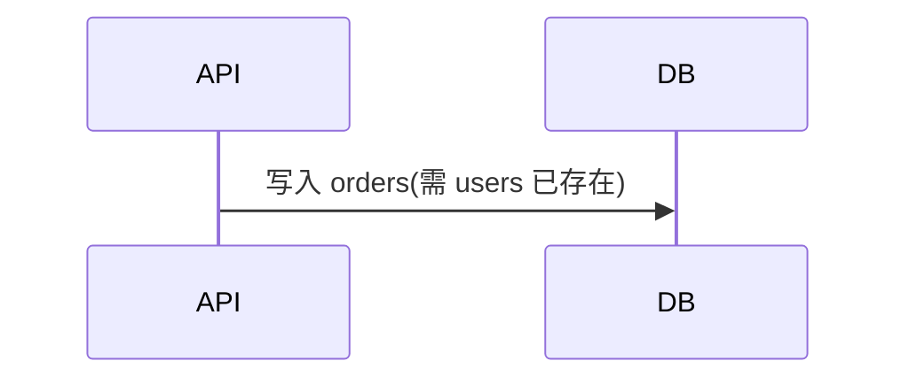

# 并行策略详解

> 本插件的核心性能特性——**全自动波次并行 + Git Worktree 隔离**。

---

## 为什么需要并行

一个真实项目的 API 契约可能包含:
- 20+ 端点(GET/POST/PUT/DELETE)
- 10+ 事件消息
- 5+ 状态机

串行处理这些是巨大的时间浪费。更糟的是,**串行让 AI 上下文腐化**——执行到第 15 个端点时,前面的实现细节已经被遗忘。

**波次并行同时解决两个问题:**
- 速度:多 worker 同时工作
- 上下文质量:每个 worker 只负责少量端点,上下文保持精简

---

## 依赖分析

### 数据源

依赖信息来自**讨论阶段的产物**——OpenAPI 契约:

```yaml
components:
  schemas:
    User:
      type: object
      properties:
        id: { type: string }
        name: { type: string }
    
    Order:
      type: object
      properties:
        userId: { type: string }  # 引用 User.id
        items: { type: array }
```

以及 Mermaid 流程图:



### 自动推导规则

| 关系 | 推导 |
|------|------|
| **Schema 引用** | A 引用 B 的字段 → A 依赖 B 的端点(至少 B 的 GET 必须先在) |
| **路径前缀** | `/orders/:id` 依赖 `/orders`(创建订单必须先能创建) |
| **事件订阅** | 订阅 `user.created` 的 worker 依赖发布 `user.created` 的 worker |
| **状态机** | 状态 A→B 转换端点依赖状态查询端点 |

### 依赖图示例

```
[GET /users] [GET /products] [GET /events]   ← Wave 1 (无依赖)
       ↓             ↓
[POST /users] [POST /orders]                   ← Wave 2
                     ↓
            [GET /orders/:id]                  ← Wave 3
```

---

## 波次划分:Kahn 算法

```python
def assign_waves(tasks, deps):
    waves = []
    remaining = set(tasks)
    while remaining:
        # 找到当前剩余任务中,所有依赖都已完成的
        ready = {t for t in remaining if deps[t] <= (tasks - remaining)}
        if not ready:
            raise CycleError("依赖循环")
        waves.append(ready)
        remaining -= ready
    return waves
```

**输出:**

```json
{
  "waves": [
    { "id": 1, "tasks": ["GET /users", "GET /products", "GET /events"], "parallel": true },
    { "id": 2, "tasks": ["POST /users", "POST /orders"], "parallel": true, "depends_on_wave": 1 },
    { "id": 3, "tasks": ["GET /orders/:id", "event:order.created"], "parallel": false, "depends_on_wave": 2 }
  ]
}
```

---

## Git Worktree 隔离

### 工作原理

```
主分支(main)
    ↓
协调器创建 N 个 worktree
    ├── .git/ql/worktrees/wt-1 (worker-1 工作)
    ├── .git/ql/worktrees/wt-2 (worker-2 工作)
    └── .git/ql/worktrees/wt-3 (worker-3 工作)
```

每个 worker:
1. 在自己的 worktree 中创建分支(`ql/wave-1/worker-1`)
2. 实现自己负责的端点/事件
3. 原子提交
4. 推送到该分支
5. 报告完成

协调器:
1. 等所有 worker 完成
2. 合并所有分支(按拓扑顺序,避免冲突)
3. 删除 worktree
4. 进入下一波次

### 为什么用 Worktree

| 方案 | 缺点 |
|------|------|
| 单分支多 worker | 文件冲突、提交交错 |
| 文件锁 | 实现复杂、易死锁 |
| **Worktree** | **天然隔离,git 原生支持** |

---

## 协调器协议

协调器(`ql-builder-coordinator`)的工作流:

```
1. 加载 OpenAPI + 流程图
2. 分析依赖,划分波次
3. 对每个波次:
   a. 为每个任务创建 worktree
   b. 并行派发 worker(子智能体,全新上下文)
   c. 等所有 worker 完成(超时/失败处理)
   d. 合并 worker 分支
   e. 删除 worktree
   f. 运行端到端验证(连通性)
   g. 若验证失败 → 暂停,生成修复 PLAN
4. 所有波次完成后,产出最终报告
```

### 派发协议

派发 worker 时,协调器提供:

```yaml
任务:实现端点 GET /users/:id
输入:
  - OpenAPI 契约(.planning/context/openapi.yaml 的相关 schema)
  - 流程图(若该端点涉及事件)
  - 骨架报告(.planning/build/skeleton-report.md,填充阶段)
工作目录:.git/ql/worktrees/wt-1
分支:ql/wave-1/get-users
产出:
  - 实现代码
  - 测试代码
  - 单端点报告
约束:
  - 不修改其他端点的文件
  - 原子提交,信息:feat(get /users): ...
返回:
  - 状态
  - 文件清单
  - 提交 hash
```

### 失败处理

| 失败类型 | 处理 |
|----------|------|
| 单个 worker 失败 | 标记该任务失败,继续其他 worker;波次结束后报告 |
| 波次验证失败 | 暂停整个构建,生成修复 PLAN,等用户决策 |
| Worktree 创建失败 | 重试一次;仍失败则降级为串行 |
| 合并冲突 | 自动尝试简单合并;复杂冲突暂停,等用户 |

---

## 并行度配置

```json
{
  "parallelization": {
    "enabled": true,
    "max_concurrent": 5,
    "isolation": "worktree",
    "auto_merge": true,
    "fail_fast": false,
    "fallback_to_sequential": true,
    "wave_timeout_minutes": 30,
    "worker_timeout_minutes": 10
  }
}
```

| 字段 | 含义 |
|------|------|
| `max_concurrent` | 同一波次最多同时 worker 数 |
| `isolation` | `worktree` / `branch` / `none` |
| `auto_merge` | 协调器自动合并 worker 分支 |
| `fail_fast` | 任一 worker 失败立即停止波次 |
| `fallback_to_sequential` | Worktree 创建失败时降级为串行 |

---

## 与 GSD execute-phase 的对比

GSD 的并行策略(`workflows/execute-phase.md`):

| 维度 | GSD | 本插件 |
|------|-----|--------|
| 派发单位 | PLAN(由规划器预定义) | **端点/事件(从 OpenAPI 自动推导)** |
| 协调器 | 执行复杂(分析 PLAN 依赖) | **更简单**(OpenAPI 已声明依赖) |
| 隔离 | Worktree | Worktree(相同) |
| 上下文 | 每 worker 全新 | 每 worker 全新(相同) |
| 失败恢复 | 复杂(PLAN 已包含修复任务) | **简单**(重跑 worker) |
| 适用场景 | 通用(任何 PLAN) | **API 服务优化** |

**核心差异:** GSD 假设需要先"规划"再"执行",本插件直接从契约推导任务。这反映了"AI 时代规划前置已无必要"的洞察。

---

## 实践建议

### 何时关闭并行

- 单文件小工具(端点数 < 3)
- 数据库 schema 大量变更(并行风险高)
- 没有 git 仓库(无法用 worktree)

### 何时提高并发

- 大量独立端点(20+)
- 端点间无 schema 共享
- 强性能需求

### 监控指标

- 协调器上下文:应保持 < 20%
- Worker 平均时长:发现瓶颈端点
- 波次合并冲突率:发现设计耦合问题

---

## 参考资料

- [Git Worktree 官方文档](https://git-scm.com/docs/git-worktree)
- [Kahn 拓扑排序](https://en.wikipedia.org/wiki/Topological_sorting)
- [Alistair Cockburn - Walking Skeleton](https://alistair.cockburn.us/walking-skeleton/)