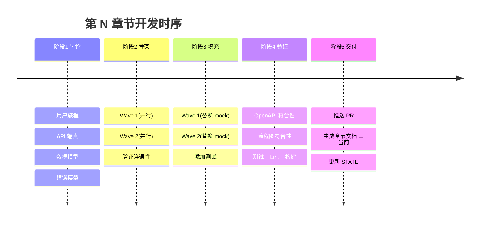

# 章节模板

> **用途:** `.qiling/docs/chapters/chapter-NN-*.md`
> **触发时机:** `/ql-ship` 成功推送 PR 后自动生成
> **关联文档:** 模板由 `templates/chapter.md` 派生,实例如 `.qiling/docs/README.md` 索引

---

## 章节文件模板

```markdown
---
chapter_id: "chapter-NN"
title: "[章节标题,如:'用户中心 API']"
phase: [N]                                # 对应的 ql 循环编号
generated_at: "[ISO timestamp]"
generated_by: "器灵工作流 v0.4.0"
ql_version: "0.4.0"
git_commit: "[hash]"
pr_url: "[GitHub PR URL]"
status: "shipped | shipped_with_gaps | shipped_failed"
---

# 第 N 章 · [章节标题]

> **API 驱动开发留档** —— 本章节文档由器灵工作流在 `/ql-ship` 成功后自动产出。
> 它既是项目开发流程的留档,也是该阶段交付 API 的开发者文档。
> **不要直接编辑本文件** —— 它会在下次 `/ql-ship` 时被覆盖。如需更正,请提交 PR 修改上游 `openapi.yaml` 或 workflow,然后重跑 `/ql-ship`。

---

## 章节摘要

| 字段 | 值 |
|------|---|
| 章节编号 | chapter-NN |
| 对应 ql 阶段 | Phase N |
| API 端点数 | [N] |
| 事件消息数 | [M] |
| 波次数 | [K] |
| 提交数 | [commits] |
| 验证状态 | passed |
| 关联 PR | [URL] |
| 生成时间 | [ISO] |

**一句话描述:** [从 OpenAPI info.description 提取]

---

## 一、本章节交付的 API(详细文档)

### 1.1 端点清单

| 方法 | 路径 | 摘要 | 认证 | 速率限制 |
|------|------|------|------|----------|
| GET | /resources | 列出资源 | Bearer | 100/min |
| POST | /resources | 创建资源 | Bearer | 30/min |
| GET | /resources/{id} | 单个资源 | Bearer | 100/min |
| ... | ... | ... | ... | ... |

### 1.2 端点详情

#### GET /resources

**摘要:** 列出所有资源

**认证:** Bearer Token (Authorization: Bearer <token>)

**请求参数(Query):**

| 名称 | 类型 | 必填 | 默认 | 范围 | 说明 |
|------|------|------|------|------|------|
| limit | integer | 否 | 20 | 1-100 | 单页最大条数 |
| offset | integer | 否 | 0 | ≥0 | 跳过条数 |
| status | string | 否 | - | draft/active/archived | 状态过滤 |

**响应 200:**

```json
{
  "items": [
    {
      "id": "uuid",
      "name": "string",
      "status": "active",
      "createdAt": "2026-08-28T10:00:00Z"
    }
  ],
  "total": 42,
  "limit": 20,
  "offset": 0
}
```

**响应 400(BadRequest):**

```json
{
  "code": "INVALID_PARAMETER",
  "message": "limit 必须为 1-100 之间的整数",
  "details": { "parameter": "limit", "value": "200" }
}
```

**响应 401(Unauthorized):**

```json
{ "code": "AUTH_REQUIRED", "message": "缺少或无效的认证令牌" }
```

**使用示例:**

```bash
# curl
curl -X GET "https://api.example.com/resources?limit=10&status=active" \
  -H "Authorization: Bearer <token>"

# TypeScript(fetch)
const res = await fetch('/api/resources?limit=10', {
  headers: { Authorization: `Bearer ${token}` }
});
const data = await res.json();

// Python(requests)
r = requests.get(
  'https://api.example.com/resources',
  params={'limit': 10, 'status': 'active'},
  headers={'Authorization': f'Bearer {token}'}
)
```

#### POST /resources

... (同上,根据 OpenAPI schema 生成)

### 1.3 数据模型(Schemas)

#### Resource

| 字段 | 类型 | 必填 | 约束 | 说明 |
|------|------|------|------|------|
| id | string (uuid) | ✅ | - | 资源唯一标识 |
| name | string | ✅ | 1-100 字符 | 资源名称 |
| description | string | 否 | ≤1000 字符 | 资源描述 |
| status | string | ✅ | draft/active/archived | 资源状态 |
| createdAt | string (date-time) | ✅ | - | 创建时间(ISO 8601) |
| updatedAt | string (date-time) | ✅ | - | 最后更新时间 |

**Schema 定义:**

```yaml
Resource:
  type: object
  required: [id, name, status, createdAt, updatedAt]
  properties:
    id: { type: string, format: uuid }
    name: { type: string, minLength: 1, maxLength: 100 }
    description: { type: string, maxLength: 1000 }
    status:
      type: string
      enum: [draft, active, archived]
    createdAt: { type: string, format: date-time }
    updatedAt: { type: string, format: date-time }
```

#### ResourceCreate

... (类似)

#### ResourceUpdate

... (类似)

#### Error(标准错误响应)

```yaml
Error:
  type: object
  required: [code, message]
  properties:
    code: { type: string }
    message: { type: string }
    details:
      type: object
      additionalProperties: true
```

### 1.4 错误码参考

| HTTP | code | 含义 | 何时触发 |
|------|------|------|----------|
| 400 | INVALID_PARAMETER | 请求参数错误 | 校验失败 |
| 401 | AUTH_REQUIRED | 未认证 | 缺失/无效 token |
| 403 | PERMISSION_DENIED | 无权限 | 角色不足 |
| 404 | NOT_FOUND | 资源不存在 | id 不存在 |
| 409 | CONFLICT | 资源冲突 | 唯一索引冲突 |
| 429 | RATE_LIMITED | 速率限制 | 超过配额 |
| 500 | INTERNAL_ERROR | 服务器错误 | 异常未处理 |

---

## 二、本章节的开发流程留档

### 2.1 阶段时序



### 2.2 讨论阶段产出

- **OpenAPI 契约:** `.planning/context/openapi.yaml`([端点数: N, schema 数: M])
- **事件流程图:** `.planning/context/event-flow.md`
- **关键决策:** [从 STATE.md 的"累积上下文 > 决策"提取]

### 2.3 构建阶段产出

- **骨架报告:** `.planning/build/skeleton-report.md`
  - 波次数:K
  - 端点 mock 数:N
  - 事件连接数:M
- **填充报告:** `.planning/build/fill-report.md`
  - mock 替换率:100%
  - 新增测试用例:N
- **波次报告:** `.planning/build/waves/*.md`—— 每个 worker 一份

### 2.4 验证阶段产出

- **验证报告:** `.planning/build/verification.md`
- **契约符合度:** 100%(N/N 端点)
- **流程符合度:** 100%(M/M 事件)
- **测试统计:** 单元 N/N、集成 N/N

### 2.5 交付阶段产出

- **PR:** [#PR 号](URL)
- **合并提交:** [hash]
- **本章节文档:** [本文件路径](.)  ← 自我引用

### 2.6 Git 历史摘要

```
[hash] feat(...): 端点 1 骨架   器灵 wave-1-worker-1
[hash] feat(...): 端点 2 骨架   器灵 wave-1-worker-2
[hash] feat(...): 端点 1 填充   器灵 wave-2-worker-1
[hash] docs(...): 章节文档      器灵 ship
```

### 2.7 关键指标

| 指标 | 值 |
|------|---|
| 协调器上下文使用 | ~15% |
| Worker 平均时长 | N 秒 |
| 波次合并冲突率 | N% |
| 测试覆盖率 | N% |

---

## 三、与上一章节的对比(变更留档)

### 3.1 新增 API

- `GET /resources`(新增)
- `POST /resources`(新增)
- ...

### 3.2 修改 API

无(如首章节)或列出字段/路径变化。

### 3.3 删除 API

无。

### 3.4 不兼容变更(破坏性)

无。

### 3.5 迁移指南

无需迁移(如首章节)。若有破坏性变更,给出"从旧版本升级"的步骤清单。

---

## 四、关联文档

- [项目状态](../STATE.md)
- [OpenAPI 契约](../context/openapi.yaml)
- [事件流程图](../context/event-flow.md)
- [构建报告](../build/build-report.md)
- [验证报告](../build/verification.md)
- [PR]([URL])

---

## 五、变更日志(本章节)

| 日期 | 操作 | 说明 |
|------|------|------|
| [ISO] | 自动生成 | `/ql-ship` 后由器灵产出 |
```

---

<purpose>

**章节文件**(`chapter-NN-*.md`)是**API + 开发流程**双重文档:
- **API 部分**(§一):从 `openapi.yaml` 自动渲染,作为开发者文档
- **流程部分**(§二):从构建/验证/交付各阶段产物自动汇总,作为项目留档
- **变更部分**(§三):与上一章节对比,作为版本迁移指南
- **索引部分**(§四):反向链接到所有源产物

**核心原则:**
- 章节文档是**只读快照**——不要手改,改了会被下次 ship 覆盖
- 章节文档**永远反映已合并的代码状态**——而不是"正在开发的"
- 章节文档是**单一可信源**——开发者和 API 使用者都从这里查

</purpose>