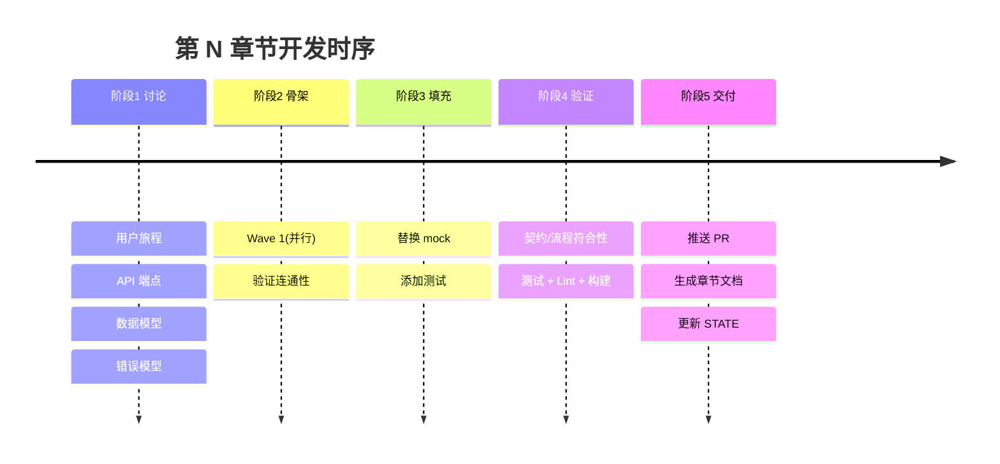

# 章节模板(说明书式)

> **用途:** `.qiling/docs/chapters/chapter-NN-*.md`
> **触发时机:** `/ql-deliver` 成功推送 PR 后自动生成(`/ql-doc`)
> **结构:** 正文五章 = 说明书(是什么 → 快速上手 → 怎么用 → 配置限制 → 排错);附录三章 = 留档与审计(交付留档 / 章节对比 / 数据来源与验证)
> **人工保护区:** `<!-- manual:ID -->` … `<!-- /manual:ID -->` 块内的内容欢迎人工撰写与润色,**重新生成时必须原样保留**(见"人工保护区"约定)

---

## 章节文件模板

```markdown
---
chapter_id: "chapter-NN"
title: "[章节标题,如:'用户中心 API']"
phase: [N]                                # 对应的 ql 循环编号
generated_at: "[ISO timestamp]"
generated_by: "器灵工作流 v0.17.0"
ql_version: "0.17.0"
git_commit: "[hash]"                      # 本章快照对应的 HEAD(新鲜度基线,由流程写入,勿手填)
pr_url: "[GitHub PR URL]"
status: "shipped | shipped_with_gaps | shipped_failed"
endpoints: [N]                            # 本章节 API 端点数(索引 README 汇总用,机器读)
events: [M]                               # 本章节事件数(同上)
---

# 第 N 章 · [章节标题]

> 本章节是 [章节标题] 的**功能说明书**,由器灵在交付后自动生成并维护。
> §一/§二 中 `<!-- manual -->` 块内的内容欢迎人工撰写润色(重新生成自动保留);其余机器节不要手改——如需更正,请修改 `openapi.yaml` 后重跑 `/ql-deliver`。

**一句话:** [从 OpenAPI info.description 提取:本章节交付什么能力、解决什么问题]

## 一、这个功能是什么

<!-- manual:overview -->
(生成器初稿,人工可润色)
- **覆盖能力:** [N] 个端点、[M] 个事件消息,完整清单见 [§三 使用说明](#三使用说明)。
- **什么时候用:** [从端点摘要归纳 2-3 条典型场景;归纳不出就省略此行,禁止臆造]
- **不适用:** [可选;无则省略]
<!-- /manual:overview -->

## 二、快速上手

<!-- manual:quickstart -->
(生成器初稿,人工可润色;目标:读者 5 分钟内完成第一次成功调用)

**前置:** [认证方式,如 Bearer Token(Authorization: Bearer <token>)]

**第一个调用:**

```bash
curl -X GET "https://api.example.com/[第一个 GET 端点的真实路径]" \
  -H "Authorization: Bearer <token>"
```

**预期结果:** [HTTP 200 + 返回结构概述]

**下一步:** 浏览 [§三 使用说明](#三使用说明) 选择需要的端点;报错时查 [§五 故障排查](#五故障排查)。
<!-- /manual:quickstart -->

## 三、使用说明(API 参考)

### 3.1 端点清单

| 方法 | 路径 | 摘要 | 认证 | 速率限制 |
|------|------|------|------|----------|
| GET | /resources | 列出资源 | Bearer | 100/min |
| POST | /resources | 创建资源 | Bearer | 30/min |

### 3.2 端点详情

#### GET /resources

**做什么:** 列出所有资源(从 OpenAPI summary/description 提取,面向使用者的叙述)

**认证:** Bearer Token (Authorization: Bearer <token>)

**请求参数(Query):**

| 名称 | 类型 | 必填 | 默认 | 范围 | 说明 |
|------|------|------|------|------|------|
| limit | integer | 否 | 20 | 1-100 | 单页最大条数 |
| offset | integer | 否 | 0 | ≥0 | 跳过条数 |
| status | string | 否 | - | draft/active/archived | 状态过滤 |

**响应 200:**

```json
{
  "items": [{ "id": "uuid", "name": "string", "status": "active" }],
  "total": 42
}
```

**使用示例:**

```bash
# curl
curl -X GET "https://api.example.com/resources?limit=10&status=active" \
  -H "Authorization: Bearer <token>"

# TypeScript(fetch)
const res = await fetch('/api/resources?limit=10', {
  headers: { Authorization: `Bearer ${token}` }
});
```

(其余端点同构渲染)

### 3.3 数据模型(Schemas)

| 字段 | 类型 | 必填 | 约束 | 说明 |
|------|------|------|------|------|
| id | string (uuid) | ✅ | - | 资源唯一标识 |
| name | string | ✅ | 1-100 字符 | 资源名称 |

(每个 Schema 一张字段表,含 YAML 定义)

## 四、配置与限制

- **认证方式:** [security scheme 摘要]
- **速率限制:** [全局/端点级;未声明写"契约未声明速率限制"]
- **分页约定:** [limit/offset 或 cursor;未声明省略]
- **已知限制:** [status=shipped_with_gaps 时写明未闭环项;shipped 写"无"]

## 五、故障排查

按错误码排查(完整错误模型以 `openapi.yaml` 为准):

| HTTP | code | 含义 | 何时触发 | 怎么处理 |
|------|------|------|----------|----------|
| 400 | INVALID_PARAMETER | 请求参数错误 | 校验失败 | 检查参数范围(见 §3.2 参数表) |
| 401 | AUTH_REQUIRED | 未认证 | 缺失/无效 token | 重新获取并携带 token |
| 404 | NOT_FOUND | 资源不存在 | id 不存在 | 核对资源 id |
| 429 | RATE_LIMITED | 速率限制 | 超过配额 | 退避重试或申请提额 |
| 500 | INTERNAL_ERROR | 服务器错误 | 异常未处理 | 携带请求 id 联系维护者 |

> 处理建议无法从契约推导时写通用处置;禁止编造项目特有的处理方式。

## 附录 A · 交付与开发留档

(本附录面向维护者与 AI 审计,读者可跳过)

### A.1 阶段时序


```mermaid
timeline
    title 第 N 章节开发时序
    阶段1 讨论 : 用户旅程 : API 端点 : 数据模型 : 错误模型
    阶段2 骨架 : Wave 1(并行) : 验证连通性
    阶段3 填充 : 替换 mock : 添加测试
    阶段4 验证 : 契约/流程符合性 : 测试 + Lint + 构建
    阶段5 交付 : 推送 PR : 生成章节文档 : 更新 STATE
```

(波次数/端点数必须是报告中的真实值;数据缺失的阶段不画)

### A.2 讨论阶段产出

- **OpenAPI 契约:** `.planning/context/openapi.yaml`(端点数: N, schema 数: M)
- **事件流程图:** `.planning/context/event-flow.md`
- **关键决策:** [从 STATE.md 的"累积上下文 > 决策"提取]

### A.3 构建与验证产出

- **骨架报告:** `.planning/build/skeleton-report.md`(波次/端点 mock/事件连接)
- **填充报告:** `.planning/build/fill-report.md`(mock 替换率/测试用例)
- **验证报告:** `.planning/build/verification.md`(契约/流程符合度)

### A.4 交付产出

- **PR:** [#PR 号](URL)
- **合并提交:** [hash]

### A.5 Git 历史摘要

```
[hash] feat(...): 端点骨架   器灵 wave-1-worker-1
[hash] feat(...): 端点填充   器灵 wave-2-worker-1
```

## 附录 B · 与上一章节对比

- **新增 API:** [列表或"无"]
- **修改 API:** [字段/路径变化或"无"]
- **删除 API:** [列表或"无"]
- **破坏性变更:** [有则给迁移步骤清单;无则写"无"]

## 附录 C · 数据来源与验证

- **关联文档:** [项目状态](../STATE.md) · [OpenAPI 契约](../context/openapi.yaml) · [事件流程图](../context/event-flow.md) · [构建/验证报告](../build/verification.md)
- **数据可信约定:** API 以 `openapi.yaml` 为单一可信源;流程数据来自构建/验证报告与 git log,未检出显式声明,不编造
- **变更日志:**

| 日期 | 操作 | 说明 |
|------|------|------|
| [ISO] | 自动生成 | `/ql-deliver` 后由器灵产出 |
```

---

<purpose>

**章节文件**(`chapter-NN-*.md`)是**功能说明书 + 留档附录**双层文档:

- **正文五章(§一~§五)面向使用者** —— 是什么(概述)→ 快速上手(第一次成功调用)→ 使用说明(参考)→ 配置与限制 → 故障排查(错误码 + 处理)。对标 Diátaxis 的"参考 + 指南"分离与 GB/T 8567 用户手册的"使用过程 + 出错处理"。
- **附录三章(附录 A~C)面向维护者与审计** —— 交付留档、章节对比(迁移指南)、数据来源与验证。
- **流程留档整体降级为附录 A** —— 开发过程时序/产出/指标不再占据说明书正文。

**核心原则:**

- 章节文档反映**已合并的代码状态**;正文机器节不要手改(改了会被下次 ship 覆盖)
- **人工保护区(`manual` 块)** —— §一/§二的 `<!-- manual:ID -->…<!-- /manual:ID -->` 块是给使用者与维护者写的位置(动机、场景、坑),重新生成章节时**必须原样保留同 ID 旧块**(见 workflows/doc.md 与 scripts/docsmap.mjs 的保留逻辑)
- 严谨性机制(单一可信源/未检出显式声明/推断标注/不画假图)保留且升级为**呈现纪律**:验证过程与证据说明集中在附录 C,正文保持说明书体验

**与 `/ql-scan` 章节的关系:** 两者共用同一骨架(正文五章 + 附录三章),断言按节标题关键词校验,不得格式分裂。

</purpose>
