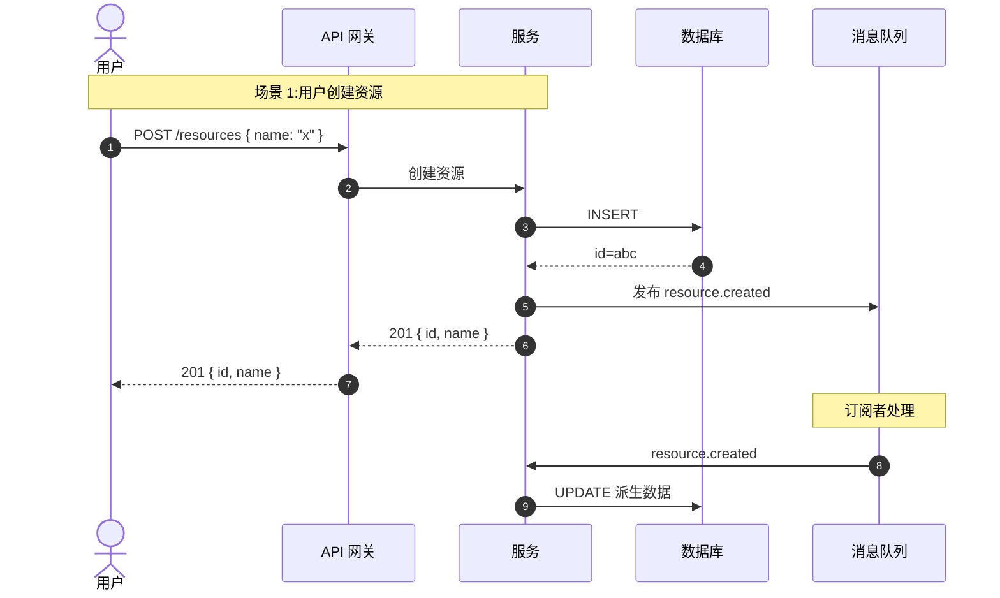
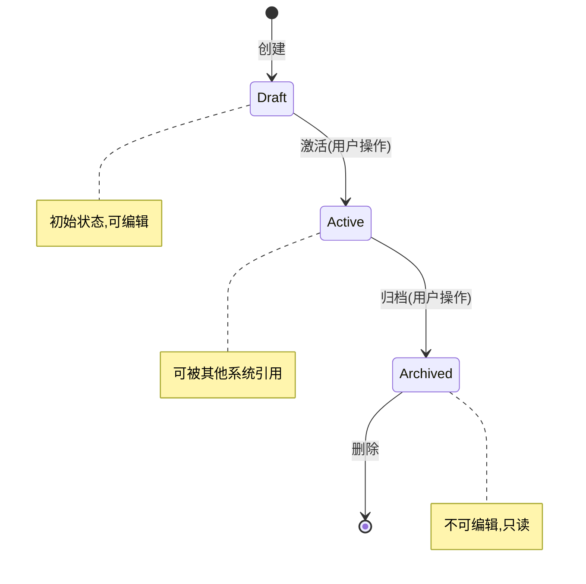

# 事件流程模板
#
# 用途:`.planning/context/event-flow.md`
#
# 包含两个图表:
# - sequenceDiagram:组件协作的时序
# - stateDiagram:关键对象的状态机

## 组件协作(sequenceDiagram)

## 关键状态机(stateDiagram)

## 事件消息契约

| 事件 | 发布时机 | Payload | 订阅者 |
|------|----------|---------|--------|
| `resource.created` | 资源创建成功后 | `{ id, name, createdAt }` | 通知服务、搜索索引 |
| `resource.updated` | 资源更新成功后 | `{ id, changes, updatedAt }` | 缓存失效、审计日志 |
| `resource.deleted` | 资源删除成功后 | `{ id, deletedAt }` | 清理派生数据 |

## 边缘场景

| 场景 | 期望行为 |
|------|----------|
| 用户快速重复创建同名资源 | 第二次返回 409 Conflict |
| 创建时数据库连接失败 | 返回 500,事务回滚,不发布事件 |
| 事件订阅者处理失败 | 重试 3 次,失败进入死信队列 |
| 状态机非法转换(如 Active → Draft) | 返回 400 Bad Request |