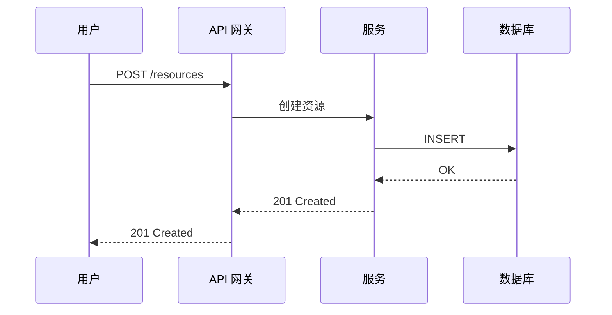
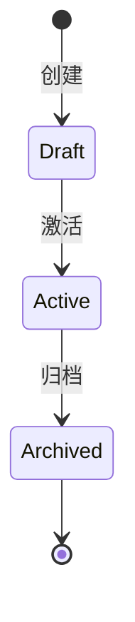

<!-- ql:loop-host
step: discuss
points: discuss:pre, discuss:post
agent-roles: ql-design-coach
produces: openapi.yaml, event-flow.md, decisions.md, STATE.md
consumes: (首次无,后续读 STATE.md)
-->

<purpose>
通过对话讨论,产出 AI 自动构建所需的输入:**OpenAPI 3.1 契约 + Mermaid 事件流程图 + 决策轨迹(decisions.md)**。

这是新设计的核心变化——讨论产出**机器可执行**的规范,而非模糊的"决策记录"。契约与流程图给构建**结论**,决策轨迹给构建**论证过程**——为什么这样设计、否掉了什么、代价是什么。下游的 worker、评审者、修 Bug 流程据此不必重新猜测设计意图。
</purpose>

<available_agent_types>
- **ql-design-coach** —— 引导对话,提炼 API 与流程(由协调器自身承担)
</available_agent_types>

<process>

## 步骤 0: Orient —— 先勘察,再提问

**绝不问环境已经能回答的问题。** 提问前先读仓库:

```bash
# 一次搞定:技术栈、脚本、现有文档、近期方向
cat package.json          # 语言、框架、已有脚本
ls README* AGENTS* 2>/dev/null   # 项目说明与 agent 约定
git log --oneline -10     # 近期在做什么
```

勘察能回答的,直接作为讨论前提,不再询问:

- 技术栈/框架 → 不问"用什么语言"
- 已有的数据模型/领域名词 → 直接复用其命名
- 近期提交方向 → 推断本阶段聚焦点

勘察后只问**真正的产品决策**:端点取舍、错误语义、事件边界、状态转换。

**契约已存在(再次进入讨论):** 就地编辑 `.planning/context/openapi.yaml` 与 `event-flow.md`——只改受本次讨论影响的部分,**绝不另建第二份规范文档**,不重新生成未受影响的章节。决策轨迹同理**就地追加**:本轮新产生的权衡写新行(编号延续);若与既有 D-N 冲突,走"取代 D-N"流程并同步修订契约,**不允许静默推翻**。

**Never-Ask 降级:** 若 `AskUserQuestion` 不可用或调用被拒(返回 Never-Ask),**仅对当前这一个决策**自决并继续:

1. 选仓库证据仍支持的推荐项,且可无人值守执行
2. 否则选证据支持的最小范围选项;优先纯文本、非交互路径
3. 决策含破坏性/不可逆操作 → 选非破坏路径,绝不自动批准破坏项
4. 在回复中说明选了什么、为什么

降级只对该决策有效;后续决策仍正常用 `AskUserQuestion` 提问。

## 步骤 1: 加载 STATE

```bash
mkdir -p .planning/context .planning/build
test -f .planning/STATE.md || cat > .planning/STATE.md <<EOF
---
ql_state_version: '1.0'
ql_version: '<当前器灵插件版本,从本插件 package.json 读取;无法确定时省略此行,由 /ql-update 补写>'
current_phase: 1
status: discussing
---
# 项目状态

## 当前位置
阶段: 1 (讨论中)
EOF
```

读取 STATE,获取 `current_phase`(讨论阶段编号)。

## 步骤 2: 引导对话(分主题)

**澄清纪律:**

- 每个问题带**推荐选项**(首选在前,标注推荐 + 一句理由),用户可直接接受
- **被排除的方向不进选项** —— 已被宪法、既有契约或仓库事实排除的方案,不占用选项位(不为注定被否的方向浪费一个提问,选项表是稀缺资源)
- 一次只问一个;候选问题超过 5 个时按**影响 × 不确定性**排序,只问前 5 个高影响问题,其余登记为默认假设
- **每个答案立即回写产物,不留聊天记录**:
  - 端点级约束 → openapi.yaml 对应 path 的 `description` 或 `x-ql-*` 扩展字段
  - 全局约定 → `info.description` 或 event-flow.md 约定段
  - 并在 openapi.yaml 追加 `## Clarifications` 注释段:`- Q: <问题> → A: <答案>(YYYY-MM-DD)`
- **非显然决策即时落决策轨迹** —— 讨论中每个需要权衡的选择(端点取舍、错误模型选型、事件边界、状态机设计、schema 拆分 vs 合并),按 `@../templates/decisions.md` 立即写入 `.planning/context/decisions.md` 一行:decision / reason / alternatives / tradeoff。质量三标准:**reason 必须绑定本次讨论的具体细节**(不写"更优雅"),**alternatives 必须是真实考虑过的命名方案**(不是稻草人),**tradeoff 必须是真代价**(不是审美托词)。用户显式指令记 Clarifications、宪法已有条文、无争议实现细节——这三类**不 trace**。一轮典型 5~10 条
- 环境勘察已能回答的,直接采用并登记为"默认假设",不再问

**用 `AskUserQuestion` 分轮提问。**

### 主题 1: 用户旅程与核心场景

> 谁会调用这个 API?他们的关键场景是什么?

提取:
- 用户角色(调用方是谁?)
- 核心场景列表(2-5 个)

### 主题 2: 核心 API 端点

> 实现这些场景需要哪些 API 端点?每个端点的输入输出是什么?

提取:
- 端点路径列表(GET/POST/PUT/DELETE)
- 请求 schema
- 响应 schema
- 错误码

### 主题 3: 数据模型

> 主要实体有哪些?它们的字段与关系?

提取:
- 实体列表
- 字段与类型
- 实体关系(一对一、一对多)

### 主题 4: 事件流(若有)

> 是否有异步消息/事件?哪些组件发出/订阅哪些消息?

提取:
- 消息名称
- 发布者/订阅者
- 消息 payload
- 时序

### 主题 5: 状态变化(若有)

> 哪些对象有生命周期?状态机是什么?

提取:
- 状态列表
- 转换条件
- 触发事件

## 步骤 3: 生成 OpenAPI 3.1 契约

用 `@../templates/openapi-spec.yaml` 创建 `.planning/context/openapi.yaml`:

```yaml
openapi: 3.1.0
info:
  title: [项目名]
  version: 0.1.0
  description: [从讨论提取]
paths:
  /resource:
    get:
      summary: [一句话]
      responses:
        '200':
          content:
            application/json:
              schema:
                $ref: '#/components/schemas/Resource'
components:
  schemas:
    Resource:
      type: object
      required: [id, name]
      properties:
        id: { type: string, format: uuid }
        name: { type: string }
```

**校验:** 至少 1 个端点,所有 schema 自洽。

## 步骤 4: 生成 Mermaid 流程图

用 `@../templates/event-flow.md` 创建 `.planning/context/event-flow.md`,包含:

### sequenceDiagram(组件交互)



### stateDiagram(关键状态)



## 步骤 4.5: 项目宪法(首次可选)

若 `.planning/context/constitution.md` 不存在,询问用户是否建立(推荐项:是,尤其多阶段项目):

- 用 `@../templates/constitution.md` 生成:技术栈红线、分层规则、安全底线(MUST/SHOULD 分级)
- 从本次讨论与环境勘察中提炼,每条**可判定**(能用是/否回答)
- 已存在则不动(修订走宪法自己的修订记录流程)

后续 `/ql-build` 划分波次、独立评审裁定都会以它为门控。

## 步骤 4.6: 契约冻结门(量化歧义度)

冻结契约前自评三个维度(各 0-10 分,评分依据写进 STATE 备注):

| 维度 | 判据 |
|------|------|
| **目标清晰度** | 本阶段要建什么,一句话说得清?端点清单无"或/待定"? |
| **约束清晰度** | 错误语义、认证、分页/幂等等约束都已确定(而非"稍后处理")? |
| **验收清晰度** | 每个端点都能写出可观察的验收结果(输入→期望输出)? |

```text
ambiguity = 1 − (目标×0.4 + 约束×0.3 + 验收×0.3) / 10
```

- **ambiguity > 0.2 → 不冻结**,回到步骤 2 继续澄清(只问拉低评分的维度)
- **实体收敛检查** —— 核心 schema/资源名与上一轮讨论相比是否稳定(改名算收敛,新增算抖动)?连续两轮无新增实体才允许冻结
- **决策轨迹检查** —— `.planning/context/decisions.md` 存在且有条目。**0 条 = 可疑信号**:大概率全是默认假设在推进、没做真实权衡——回步骤 2 抽查 2~3 个"看似显然"的选择(错误模型、分页约定、幂等语义),确认它们真的是显然的而非被跳过的
- 冻结时在 STATE 记录评分表(Clarity Breakdown)与默认假设清单(Assumptions Exposed),供后续阶段否决

**讨论结束从主观判断变成可展示的数值。**

## 步骤 5: 更新 STATE

```yaml
---
current_phase: 1
status: discussed
api_endpoints_count: N
event_messages_count: M
---
```

## 步骤 6: 提示下一步

呈现:
- API 端点数量
- 事件消息数量
- 关键流程图场景摘要
- 澄清回写条数与默认假设清单
- 决策轨迹条数(active),一两句点出最关键的取舍(供用户复核"否掉的备选"是否可接受)
- 宪法状态(新建 / 已存在 / 用户跳过)
- 下一步:`/ql-build`

**终态绑定:** 契约未经用户确认前,唯一合法出口是**继续澄清**;契约经用户确认后,唯一合法出口是 **`/ql-build`**——不允许绕过构建直接写实现代码。

</process>