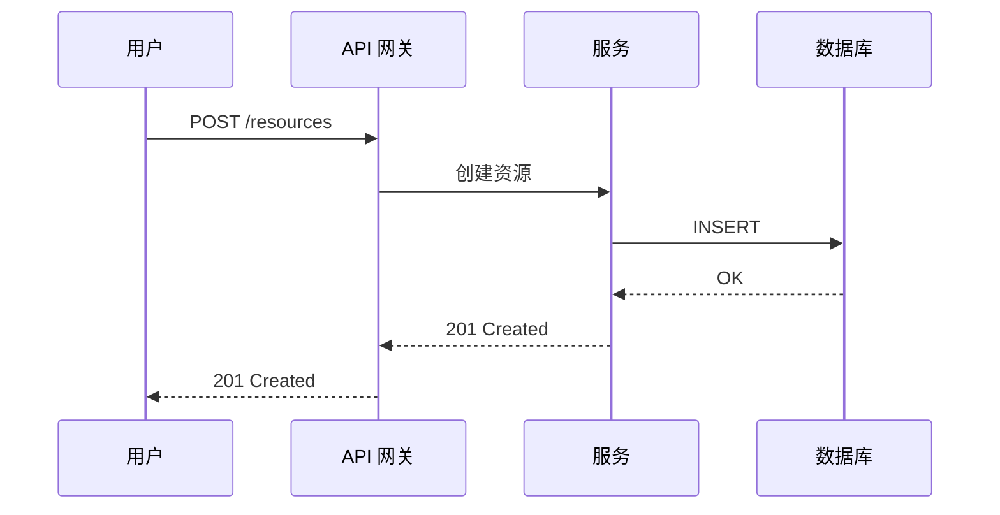
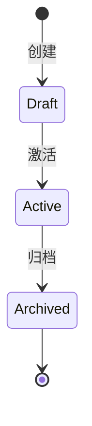

<!-- ql:loop-host
step: discuss
points: discuss:pre, discuss:post
agent-roles: ql-discuss-coach
produces: openapi.yaml, event-flow.md, STATE.md
consumes: (首次无,后续读 STATE.md)
-->

<purpose>
通过对话讨论,产出 AI 自动构建所需的输入:**OpenAPI 3.1 契约 + Mermaid 事件流程图**。

这是新设计的核心变化——讨论产出**机器可执行**的规范,而非模糊的"决策记录"。
</purpose>

<available_agent_types>
- **ql-discuss-coach** —— 引导对话,提炼 API 与流程(由协调器自身承担)
</available_agent_types>

<process>

## 步骤 1: 加载 STATE

```bash
mkdir -p .planning/context .planning/build
test -f .planning/STATE.md || cat > .planning/STATE.md <<EOF
---
ql_state_version: '1.0'
current_phase: 1
status: discussing
---
# 项目状态

## 当前位置
阶段: 1 (讨论中)
EOF
```

读取 STATE,获取 `current_phase`(讨论阶段编号)。

## 步骤 2: 引导对话(分主题)

**用 `AskUserQuestion` 分轮提问。**

### 主题 1: 用户旅程与核心场景

> 谁会调用这个 API?他们的关键场景是什么?

提取:
- 用户角色(调用方是谁?)
- 核心场景列表(2-5 个)

### 主题 2: 核心 API 端点

> 实现这些场景需要哪些 API 端点?每个端点的输入输出是什么?

提取:
- 端点路径列表(GET/POST/PUT/DELETE)
- 请求 schema
- 响应 schema
- 错误码

### 主题 3: 数据模型

> 主要实体有哪些?它们的字段与关系?

提取:
- 实体列表
- 字段与类型
- 实体关系(一对一、一对多)

### 主题 4: 事件流(若有)

> 是否有异步消息/事件?哪些组件发出/订阅哪些消息?

提取:
- 消息名称
- 发布者/订阅者
- 消息 payload
- 时序

### 主题 5: 状态变化(若有)

> 哪些对象有生命周期?状态机是什么?

提取:
- 状态列表
- 转换条件
- 触发事件

## 步骤 3: 生成 OpenAPI 3.1 契约

用 `@../templates/openapi-spec.yaml` 创建 `.planning/context/openapi.yaml`:

```yaml
openapi: 3.1.0
info:
  title: [项目名]
  version: 0.1.0
  description: [从讨论提取]
paths:
  /resource:
    get:
      summary: [一句话]
      responses:
        '200':
          content:
            application/json:
              schema:
                $ref: '#/components/schemas/Resource'
components:
  schemas:
    Resource:
      type: object
      required: [id, name]
      properties:
        id: { type: string, format: uuid }
        name: { type: string }
```

**校验:** 至少 1 个端点,所有 schema 自洽。

## 步骤 4: 生成 Mermaid 流程图

用 `@../templates/event-flow.md` 创建 `.planning/context/event-flow.md`,包含:

### sequenceDiagram(组件交互)



### stateDiagram(关键状态)



## 步骤 5: 更新 STATE

```yaml
---
current_phase: 1
status: discussed
api_endpoints_count: N
event_messages_count: M
---
```

## 步骤 6: 提示下一步

呈现:
- API 端点数量
- 事件消息数量
- 关键流程图场景摘要
- 下一步:`/ql-build`

</process>